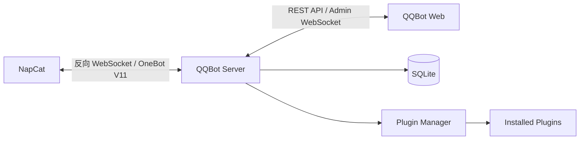

`QQBot` 是我这段时间在做的一个项目。

它的定位很明确: 做一个 **面向 NapCat 的 QQ 机器人 Web 管理面板**。相比直接围绕底层去手动配、手动看日志、手动改配置，我更想把这些事情放进一个可视化界面里，让 Bot 的配置、连接、消息、插件和运行状态都能在一个地方管理起来。

::github{repo="dix8/QQBot"}

> [!TIP]
> 如果你已经在用 NapCat，或者准备开始折腾 QQ Bot，但又不想把日常管理、配置调整、插件维护和运行状态全都压在命令行和底层配置上，那这个项目大概就是给你准备的。

## 这个项目适合谁

我觉得 `QQBot` 比较适合下面这几类人：

- 已经在用 NapCat，希望有一个更直观的 Web 管理入口
- 有多个 Bot，要管理连接、配置和状态，不想全靠手动维护
- 想给 Bot 加插件，但希望插件有统一的安装、启用、禁用和配置入口
- 希望把消息记录、运行日志、统计和审计沉淀下来
- 想尽快把项目跑起来，不想在部署阶段先折腾一堆环境问题

如果你只是想跑一个非常简单、几乎不需要维护的单 Bot 环境，那直接用底层方案也完全可以。

但只要你开始希望它更可管理、更可维护，或者准备长期使用，`QQBot` 这种中间层就会开始有意义。

## 为什么不是直接用 NapCat 就够了

NapCat 本身已经能把 QQ 机器人跑起来，也能通过 OneBot V11 提供不错的能力，但真到了日常使用和维护的时候，很多事情还是偏底层：

- 连接状态要自己盯
- 配置修改不够直观
- 多 Bot 管理会变得零散
- 插件扩展缺少一套统一的管理入口
- 消息、日志、统计、审计这些信息分散在不同地方

我想做的，不是替代 NapCat，而是在它上面补一层真正适合长期使用和维护的管理界面。

## 项目想解决什么问题

这个项目最早的出发点其实很简单：围绕 QQ Bot 的很多使用和维护动作，都值得被整理成一个真正能长期使用的系统，而不是一直停留在“能跑就行”的阶段。

结合最初的需求文档，我主要想把几件事做好：

- 让 NapCat 的连接状态和 Bot 状态可以被直观看到
- 让 Bot 配置可以在 Web 页面里完成，而不是每次都去改底层
- 让插件安装、启用、禁用、删除、重载这些操作有统一入口
- 让消息记录、统计数据、日志和审计信息沉淀下来
- 让部署尽量简单，既能 Docker，也能做 Windows 便携包

从结果上看，`QQBot` 更像是一个围绕 QQ 机器人运行和维护场景搭出来的小型管理系统，而不是一个单纯的“Web 外壳”。

## 如果你想直接上手

目前项目支持两种比较直接的方式：

- `Docker` 单容器部署
- `Windows` 便携包部署

如果只是想先试一下，我更建议这样：

1. 先看仓库说明，确认你本地已经有 NapCat 的运行环境
2. 用 Docker 或便携包把 `QQBot` 跑起来
3. 在 NapCat 里把反向 WebSocket 指到 `QQBot`
4. 打开 Web 面板开始配置 Bot、插件和规则

对很多人来说，能不能“很快试起来”，比功能列表本身还重要。`QQBot` 这块我也尽量往低门槛方向做了。

## 技术选型

这个项目目前是前后端分离结构，整体技术栈比较直接：

| 层级 | 技术 |
| --- | --- |
| 前端 | Vue 3 + TypeScript + Vite + Tailwind CSS + Pinia + Shadcn-vue |
| 后端 | Node.js + TypeScript + Fastify + ws |
| 数据库 | SQLite + better-sqlite3 + Drizzle ORM |
| 通信 | Reverse WebSocket + OneBot V11 |
| 部署 | Docker / Windows 便携包 |

我比较看重的是这套技术组合够直接，也够实用：

- Vue 3 + Vite 适合把管理面板做得足够轻快
- Fastify 比较适合这类 API + WebSocket 并存的场景
- SQLite 足够轻，部署和迁移成本都低
- TypeScript 可以把前后端的数据结构和边界都收紧一点

## 整体结构

项目目录本身也比较清晰，主要分成 `web` 和 `server` 两部分：

```text
QQBot/
├── server/    # Fastify + ws + SQLite + 插件系统
├── web/       # Vue 3 管理面板
├── docs/      # 项目文档
├── scripts/   # 构建脚本
└── plugins/   # 插件相关资源
```

如果从运行关系上看，大概可以理解成下面这样：



这里面我比较在意的一个点是: **Web 面板不直接碰 Bot 运行逻辑，而是通过服务端统一接住连接、配置、消息、插件和数据持久化**。这样边界会清楚很多，后面扩展也更稳。

## 目前已经实现的核心能力

从现在这份代码和 README 来看，`QQBot` 主体功能其实已经比较完整了。

### 1. 反向 WebSocket 接入 NapCat

服务端以 WebSocket 服务端的形式接收 NapCat 连接，按 Bot 维度管理连接状态，并且能处理替换旧连接、认证、心跳超时、连接日志这些问题。

这部分是整个系统真正的基础。Bot 连不上，后面所有可视化管理都没有意义。

### 2. 多 Bot 管理

项目不是只围绕单个 Bot 来设计的，而是从一开始就考虑了多实例管理：

- Bot 独立配置
- 独立连接
- 独立消息统计
- 独立插件上下文

这点对后面做插件系统和配置系统都很关键。

### 3. 仪表盘和实时状态

前端仪表盘不只是一个静态页面，它会结合 REST API 和 Admin WebSocket 做实时状态更新，展示：

- 当前连接数
- Bot 在线状态
- 发送消息总量
- 内存和 CPU 使用情况
- 24 小时 / 7 天 / 30 天统计趋势
- 活跃群组和用户排行

这部分体验上会比“只看日志”直观很多。

### 4. 插件系统

这是我自己比较看重的一块。

项目里的插件不是简单地把 JS 文件塞进去执行，而是做了一整套围绕插件生命周期和权限边界的约束：

- ZIP 安装
- `manifest.json` 描述元信息
- 生命周期钩子
- 指令声明
- 配置 schema
- 优先级
- 异常隔离
- 热重载
- 自动清理托管定时器

更关键的是，插件系统不是只管“能不能跑”，还考虑了 **Web 面板如何理解插件**。比如配置表单自动渲染、指令展示、文档展示、图标展示，这些都不是后补的。

### 5. 消息、日志和审计

除了连接和配置之外，项目还把运行时信息沉淀了下来：

- 消息记录持久化
- 趋势统计
- 群组 / 用户排行
- 系统日志
- 插件日志
- 管理操作审计日志

这让项目的定位从“控制面板”更进一步变成了“可管理、可追踪、可回看”的后台。

### 6. 部署方式

这部分我刻意做得比较实用。

目前支持两种主要部署方式：

- Docker 单容器部署
- Windows 便携包部署

Windows 便携包这点我觉得挺重要，因为很多实际用户并不想先配一整套 Node.js 运行环境。直接解压、双击启动，对很多人来说才是真正能用。

如果只是推荐别人先试试，我通常也会优先建议从这两种方式入手，而不是让对方先自己拆前后端开发环境。

## 我最想做好的部分：插件系统

如果说这个项目有什么地方最能体现“它不只是一个面板”，那大概就是插件系统。

插件开发文档里已经把这套模型写得比较清楚了。项目里采用的是两层上下文：

- `PluginAppContext`
  用在应用层，不绑定具体 Bot 连接，适合定时任务、插件配置、日志、数据目录这种全局能力
- `PluginEventContext`
  用在事件层，绑定到具体消息 / 通知 / 请求事件，适合发送消息、调用 OneBot API、读取 Bot 级配置

这种拆法的好处是，插件在什么场景下能做什么事，边界会更明确。

同时，插件还支持：

- `configSchema` 自动生成配置界面
- 指令注册与自动检测
- README 文档展示
- 图标展示
- 优先级控制
- 连续异常自动禁用

> [!WARNING]
> 插件系统虽然有权限声明和上下文约束，但它**不是沙箱**。
> 
> 插件和主进程共享同一个 Node.js 运行时，这意味着安装不可信插件本质上就是在服务器上执行不可信代码。这一点在项目文档里我也专门写明了。

## 这个项目现在处于什么阶段

如果只看当前代码和版本记录，我会把它定义成：

**主体已经完成，正在继续迭代。**

目前已经不再是“只有想法和原型”的阶段，而是：

- 核心通信已经跑通
- 前后端结构已经建立起来
- 主要管理功能已经具备
- 插件系统已经落地
- 部署方式已经成型
- 项目也已经进入版本迭代状态

像 `0.2.0` 这一版里，又接入了更新检查、公告展示、自动构建流程这些能力，也说明这个项目已经进入“继续完善细节和体验”的阶段，而不是从零开始堆功能。

## 后面还想继续做什么

这个项目后面我还会继续往几个方向打磨：

- 把插件生态做得更完整一点
- 继续补文档和开发体验
- 把配置系统和可视化交互做得更顺一点
- 把消息管理、统计和审计这几块继续做细
- 继续压部署成本，让更多场景下都能更容易落地

## 最后

`QQBot` 对我来说不是一个“为了写在项目页上好看一点”而做出来的东西。

它更像是一个从真实需求里长出来的项目：先有明确问题，再慢慢把通信、配置、插件、管理、部署这些部分一块块补齐。

后面这个项目我还会继续写，也会继续迭代。

如果你刚好也在折腾 QQ Bot、NapCat、OneBot，或者正想找一个更适合长期使用的 QQ 机器人管理面板，那这个项目大概值得你看一眼。

对我来说，这篇文章既是项目介绍，也算是一份比较正式的推荐说明。后面这个项目还会继续迭代，相关内容我也会继续写下去。
